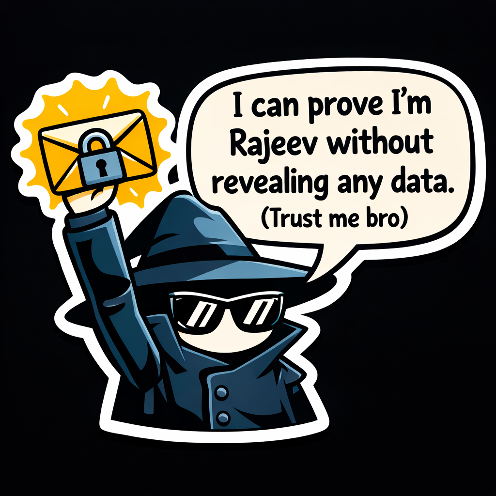

  

<h3 align="center">Researching ZKPs | Building Distributed Systems | 3rd Year CS Undergrad @IIITS</h3>

 

<table align="center" width="100%">
  <tr>
    <td width="50%" valign="top" align="center">
      <h3>Tech Arsenal</h3>
      <b>Languages</b> 
        
      <b>Infrastructure & Parallelism</b> 
        
      <b>Web & Databases</b> 
        
      <b>Specializations</b> 
      
       
      
      
    </td>
    <td width="50%" valign="top" align="center">
      <h3>Developer Activity</h3>
        
      
    </td>
  </tr>
  <tr>
    <td colspan="2" align="center">
      <h3>Code Contributions</h3>
      
    </td>
  </tr>
  <tr>
    <td colspan="2" align="center">
      <h3>🔗 Let's Connect</h3>
       &nbsp;&nbsp;
       &nbsp;&nbsp;
      
    </td>
  </tr>
</table>
